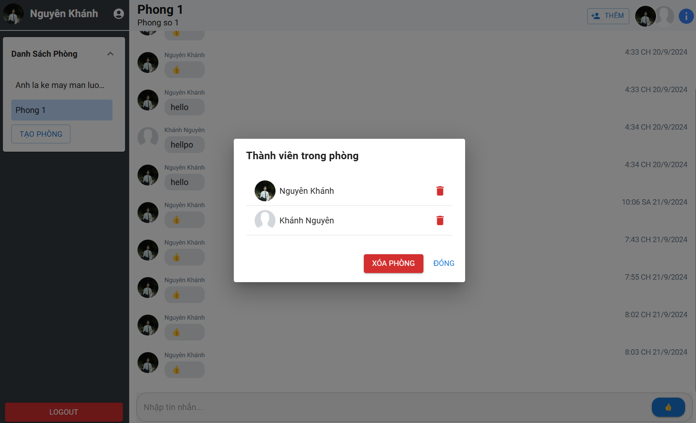

# Chat App

**Chat App** là một ứng dụng nhắn tin được phát triển bằng Next.js phiên bản 14.2.14 và Firebase, sử dụng công nghệ mới nhất của Next.js.

Ứng dụng tích hợp các thư viện hỗ trợ như Material UI, Tailwind và Sass để tạo ra giao diện đẹp mắt và phong cách.

_Dự án được viết bởi Khánh Nguyên_

## Tính Năng

-   **Đăng nhập dễ dàng**: Hỗ trợ đăng nhập qua tài khoản Google hoặc Facebook, cũng như bằng tài khoản Gmail và mật khẩu đã đăng ký.
-   **Tạo phòng nhắn tin**: Người dùng có thể tạo phòng nhắn tin mới và thêm bạn bè thông qua lựa chọn hoặc bằng ID cá nhân.
-   **Quản lý thành viên**: Xem danh sách thành viên trong phòng, xóa phòng và xóa thành viên khi cần.
-   **Nhắn tin trực tiếp**: Gửi và nhận tin nhắn theo thời gian thực, mang đến trải nghiệm trò chuyện mượt mà.

## Công Nghệ Sử Dụng

-   React 18
-   Next.js 14.2.11
-   Firebase 10
-   Tailwind
-   Material UI
-   Material Icons
-   Sass 1.78
-   React Hook Form
-   Cookies Next

## Hình Ảnh Minh Họa

**Page Login**  
  
**Page Sign Up**  
  
**Page Home**  
  
**New Room**  
  
**In Room**  
  
**Add Member**  
  
**Room Detail**  


## Tải Về

Để sử dụng cục bộ, bạn có thể làm theo các bước sau:

```bash
npm install
yarn dev
```

-   Bạn phải có file env chứa key của firebase

## Liên hệ

-   Mọi phản hồi liên hệ đến Khánh Nguyên

## Giấy Phép

Dự án này được cấp phép theo Giấy phép MIT. Xem tệp LICENSE để biết chi tiết.

    Hoàn thành 21/9/2024

_Cảm ơn bạn đã xem qua Chat App! Chúng tôi hy vọng bạn thấy nó hữu ích và thú vị. Chúc bạn lập trình vui vẻ!_
